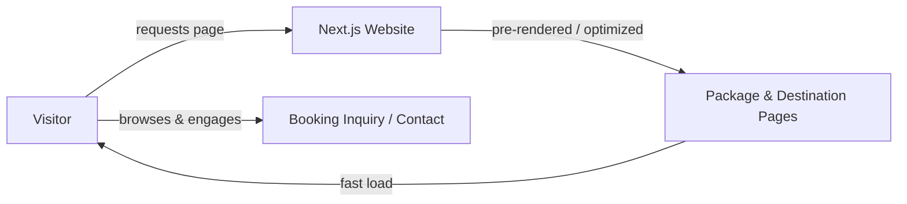

# Travel and Tour Management Website

A marketing website built for a travel and tour business that needed a fast, good-looking site to showcase its packages and destinations and turn visitors into customers. The site is built with Next.js (App Router) for speed and Tailwind CSS for a clean, consistent look across pages.

## Overview

For a travel business, the website is often the first impression a potential customer gets — slow pages or a cluttered layout can lose a booking before a conversation even starts. This project focuses on clear, attractive pages for tour packages and destinations, built to load fast and work equally well on phones and desktops.

## Key Features

- **Package & destination pages** — clear, visual layouts showcasing tours and locations, including day-by-day itineraries, inclusions/exclusions and pricing
- **Filterable tour packages** — search plus destination, trip-style and sort filters, all client-side
- **Mobile-first design** — built with Tailwind CSS for a consistent look on any screen size
- **Fast page loads** — statically generated pages, courtesy of Next.js's built-in performance optimizations
- **Conversion-focused UI/UX** — simple navigation and clear calls to action, from destination cards through to a booking inquiry form, to keep visitors engaged

## How It Works

## Tech Stack

| Layer      | Technology     |
|-------------|-----------------|
| Framework   | Next.js (App Router) |
| Language    | TypeScript       |
| Styling     | Tailwind CSS v4  |
| Icons       | lucide-react     |

## Impact

- Reached a **90+ Lighthouse performance score** through Next.js's page optimization features
- Improved visitor engagement and reduced bounce rate with a clean, easy-to-use design across desktop and mobile

## About This Project

Built as a client project with Next.js, TypeScript and Tailwind CSS. The source is kept out of this public repo to respect client confidentiality; the sections above describe the architecture and approach rather than the implementation itself.

## Author

**Ahmad Bahar**
Software Engineer | Full Stack Developer
[Portfolio](https://ahmadd-portfolio.netlify.app) · [LinkedIn](https://linkedin.com/in/ahmad-bahar-b3962324a) · [GitHub](https://github.com/Ahmadbahar11)
